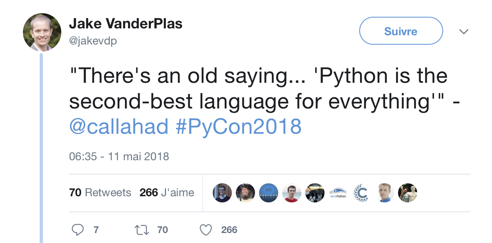

---
jupyter:
  jupytext:
    text_representation:
      extension: .md
      format_name: markdown
      format_version: '1.3'
      jupytext_version: 1.19.3
  kernelspec:
    display_name: Python 3 (ipykernel)
    language: python
    name: python3
---

# Introduction





## History

- Project initiated by Guido Von Rossum in 1990
- Interpreted language written in C.
- Widely used in all domains (Web, Data Science, Scientific Computation).
- This is a high level language with a simple syntax. 
- Python types are numerously and powerful.
- Bind Python with other languages is easy.
- You can perform a lot of operations with very few lines.
- Available on all platforms Unix, Windows, Mac OS X...
- Many libraries offer Python bindings.
- Python 2 is retired use only Python 3


## Performances
 Python is not fast... but:
- Sometimes it is. 
- Most of operations are optimized.
- Package like numpy can reduce the CPU time.
- With Python you can save time to achieve your project.

Some advices:
- Write your program with Python language. 
- If it is fast enough, be happy.
- After profiling, optimize costly parts of your code.

"Premature optimization is the root of all evil" (Donald Knuth 1974)


## Jupyter - Start The Notebook

Open the notebook
```
git clone https:://github.com/pnavaro/python-notebooks
cd python-notebooks/notebooks
jupyter notebook
```
You should see the notebook open in your browser. If not, go to http://localhost:8888

The Jupyter Notebook is an interactive environment for writing and running code. The notebook is capable of running code in a wide range of languages. However, each notebook is associated with Python3 kernel.


## Code cells allow you to enter and run code

**Make a copy of this notebook by using the File menu.**

Run a code cell using `Shift-Enter` or pressing the <button class='btn btn-default btn-xs'><i class="icon-step-forward fa fa-step-forward"></i></button> button in the toolbar above:

There are two other keyboard shortcuts for running code:

* `Alt-Enter` runs the current cell and inserts a new one below.
* `Ctrl-Enter` run the current cell and enters command mode.

<!-- #region -->


## Managing the Kernel

Code is run in a separate process called the Kernel.  The Kernel can be interrupted or restarted.  Try running the following cell and then hit the <button class='btn btn-default btn-xs'><i class='icon-stop fa fa-stop'></i></button> button in the toolbar above.

The "Cell" menu has a number of menu items for running code in different ways. These includes:

* Run and Select Below
* Run and Insert Below
* Run All
* Run All Above
* Run All Below


<!-- #endregion -->

<!-- #region -->
## Restarting the kernels

The kernel maintains the state of a notebook's computations. You can reset this state by restarting the kernel. This is done by clicking on the <button class='btn btn-default btn-xs'><i class='fa fa-repeat icon-repeat'></i></button> in the toolbar above.


Check the [documentation](https://jupyter-notebook.readthedocs.io/en/latest/examples/Notebook/Notebook%20Basics.html).
<!-- #endregion -->

## First program

- Print out the string "Hello world!" and its type.
- Print out the value of `a` variable set to 6625 and its type.

```python
s = "Hello World!"
print(type(s),s)
```

```python
a = 6625
print(type(a),a)
```

```python
# a+s
```

## Execute using python

```python
%%file hello.py

s = "Hello World!"
print(type(s),s)
a = 6625
print(type(a),a)
```

<!-- #region -->
```bash
$ python3 hello.py
<class 'str'> Hello World!
<class 'int'> 6625
```
<!-- #endregion -->

## Execute with ipython
```ipython
(my-env) $ ipython
Python 3.6.3 | packaged by conda-forge | (default, Nov  4 2017, 10:13:32)
Type 'copyright', 'credits' or 'license' for more information
IPython 6.2.1 -- An enhanced Interactive Python. Type '?' for help.

In [1]: run hello.py
<class 'str'> Hello World!
<class 'int'> 6625
```

```python
%run hello.py
```

## Python Types
- Most of Python types are classes, typing is dynamic.
- ; symbol can be used to split two Python commands on the same line.

```python
s = int(2010); print(type(s))
s = 3.14; print(type(s))
s = True; print(type(s))
s = None; print(type(s))
s = 1.0j; print(type(s))
s = type(type(s)); print(type(s))
```

## Calculate with Python

```python
x = 45        # This is a comment!
x += 2        # equivalent to x = x + 2
print(x, x > 45)
```

```python
y = 2.5
print("x+y=",x+y, type(x+y))  # Add float to integer, result will be a float
```

```python
print(x*10/y)   # true division returns a float
print(x*10//3)  # floor division discards the fractional part
```

```python
print( x % 8) # the % operator returns the remainder of the division
```

```python
print( f" x = {x:05d} ") # You can use C format rules to improve print output
```

## Multiple Assignment
- Variables can simultaneously get new values. 
- Expressions on the right-hand side are all evaluated first before assignments take place. 
- The right-hand side expressions are evaluated from the left to the right.
- Use it very carefully

```python
a = b = c = 1
print(a, b, c) 
```

```python
a, b, c = 1, 2, 3
print (a, b, c)
```

```python
a, c = c, a     # Nice way to permute values
print (a, b, c) 
```

```python
a < b < c, a > b > c
```

## `input` Function

- Value returned by input is a string.

- You must cast input call to get the type you want.
```py
name = input("Please enter your name: ")
x = int(input("Please enter an integer: "))
L = list(input("Please enter 3 integers "))
```
Copy-pase code above in three different cells and print returned values.

